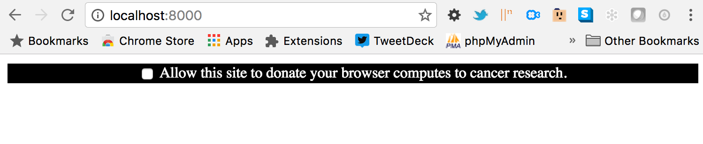

# Computes.js

Add computes cores to your website to harness your customers' browser processors for your kernel jobs.



This will display a computes message at the top of your website. Users must opt into your computes campaign by clicking the checkbox. Their input is stored as a cookie so that your site remembers their selection on return visits or page transitions.

## Getting started

Simply add this script to the end of your webpage directly before the closing html tag.

````
<script id="computes" data-charity-text="cancer research" data-domain-key="computes" src="computes.js"></script>
````

There are two parameters in the script to configure:

data-charity-text = This text gets displayed at the end of the computes message on your website.

data-domain-key = This is the domain key assigned to you from [computes.io](http://app.computes.io).
